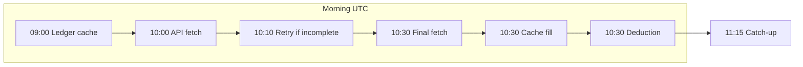

# Token deduction: auto flow, manual trigger (soft pad), and test plan

## Goal

Token deduction is the platform’s main profit and must be **100% accurate**. If the server is down or the API is not working, **manual trigger** is the **soft pad**: one admin action refreshes snapshots from Bitfinex (and 09:00 cache), then runs deduction so revenue is not lost.

**Bitfinex timing:** Daily gross (Margin Funding Payment) is released around **9:30 UTC**; for some users data can be **late until 10:30 UTC**. The auto flow includes a final fetch at 10:30 for users still without `daily_gross` so late-released profit is captured.

---

## Auto deduction flow



| Time (UTC) | What runs | Purpose |
|------------|-----------|--------|
| **09:00** | Ledger cache | Fetch Margin Funding ledgers for all users with vault; store in Redis (7-day TTL). If 10:00 fails (e.g. key deleted), 10:30 can still deduct from this cache. |
| **10:00** | API fetch | For each user: Option B currencies (credits + wallets), fetch ledgers, convert to USD, write `gross_profit_usd` and `daily_gross_profit_usd` to `user_profit_snapshot`. |
| **10:10** | Retry | Re-run 10:00 only for users whose latest ledger entry was &lt; 20 mins old (data incomplete). |
| **10:30** | Final fetch, then cache fill, then deduction | 1) **Final fetch:** For users with `daily_gross_profit_usd` 0/None, re-fetch from Bitfinex with **accept fresh data** (no 20-min age check) so late-released profit (up to 10:30) is captured. 2) Apply 09:00 cache for users still with 0/None. 3) `run_daily_token_deduction`: deduct `daily_gross_profit_usd` (1:1 USD) from `tokens_remaining`; skip if `last_deduction_processed_date == today`. |
| **11:15** | Catch-up | Users who **restored** their API key after 10:30: re-fetch ledger, then run deduction for those user_ids only. |

- **daily_gross_profit_usd** = sum of all Margin Funding Payment profit for **that UTC day**, in USD (stablecoins 1:1, others via tCCYUSD).
- Currencies: Option B (credits + wallets) so we only fetch ledgers for currencies the user has activity in; fallback = full list (USD, USDT, USDt, UST, BTC, ETH, …).

---

## Manual trigger (soft pad)

**Endpoint:** `POST /admin/deduction/trigger?refresh_first=true` (default)

Manual trigger is the **soft pad** when the **server is down** or the **API is not working**: one action refreshes from Bitfinex (and 09:00 cache) then runs deduction for 100% accuracy.

When **refresh_first=true** (recommended when 10:00/10:30 failed or server was down):

1. **Refresh snapshots**  
   For every user with a vault, run the same logic as 10:00:  
   `_daily_10_00_fetch_and_save(user_id)` (Bitfinex ledgers → USD → snapshot).  
   Uses the same delay between users as the 10:00 job.

2. **09:00 cache fallback**  
   `_apply_09_00_cache_before_deduction(db, redis)`: fill `daily_gross_profit_usd` from 09:00 cached ledger for users still with 0/None.

3. **Run deduction**  
   `run_daily_token_deduction(db)`: deduct from refreshed (or cache-filled) snapshot.  
   No double-charge: `last_deduction_processed_date` prevents processing the same day twice.

Response includes `refreshed` (number of users whose snapshot was refreshed) and `count` (number of users deducted).

When **refresh_first=false**: only step 3 runs (deduction from existing snapshot; no API calls). Use when you only want to re-run deduction without hitting Bitfinex.

---

## Test plan (uid 2)

You can verify the flow for **user_id=2** in two ways.

### Option 1: Script (local, no admin auth)

Run the **deduction test script** for uid 2. It:

1. Prints current snapshot and balance for uid 2.
2. Refreshes the snapshot (10:00-style fetch for uid 2 only).
3. Prints new `daily_gross_profit_usd` and cumulative gross.
4. Optionally runs deduction for uid 2 only (`--apply`); otherwise dry-run.

```bash
# From project root
python scripts/run_deduction_test_uid2.py 2           # refresh + dry-run (no deduct)
python scripts/run_deduction_test_uid2.py 2 --apply  # refresh + actually deduct for uid 2
```

Use this to see exact numbers (daily_gross, tokens before/after) and to confirm refresh + deduction logic without touching other users.

### Option 2: Admin API (manual trigger)

1. **Refresh + deduct all users (soft pad)**  
   ```http
   POST /admin/deduction/trigger?refresh_first=true
   ```
   (Default. Use when 10:00 failed or server was down.)

2. **Deduct only (no refresh)**  
   ```http
   POST /admin/deduction/trigger?refresh_first=false
   ```

3. **Check logs**  
   ```http
   GET /admin/deduction/logs?limit=20
   ```
   Confirm uid 2 appears with the expected `daily_gross_profit_usd` and `tokens_deducted`.

If `TEST_SCHEDULER_SECONDS` or a test user is set, the manual trigger refresh step may only process that test user (same as 10:00).

---

## Checks for uid 2

After a run (script with `--apply` or manual trigger):

- **Snapshot**  
  `user_profit_snapshot.daily_gross_profit_usd` = today’s Margin Funding Payment profit in USD.  
  `last_deduction_processed_date` = today if deduction ran.

- **Balance**  
  `user_token_balance.tokens_remaining` decreased by `daily_gross_profit_usd` (1:1).  
  `last_gross_usd_used` = amount deducted.

- **Deduction log**  
  One row in `deduction_log` (or in-memory log) for today with `user_id=2`, `tokens_deducted` = daily_gross.

Run `python scripts/check_deduction_eligibility_user2.py 2` to see current snapshot and whether the user would be deducted (without changing data).

**Note:** If the script prints "Data incomplete (latest entry < 20 mins)", the snapshot is not updated (same as 10:00 logic). Run again after the ledger is older, or use manual trigger later in the day.
